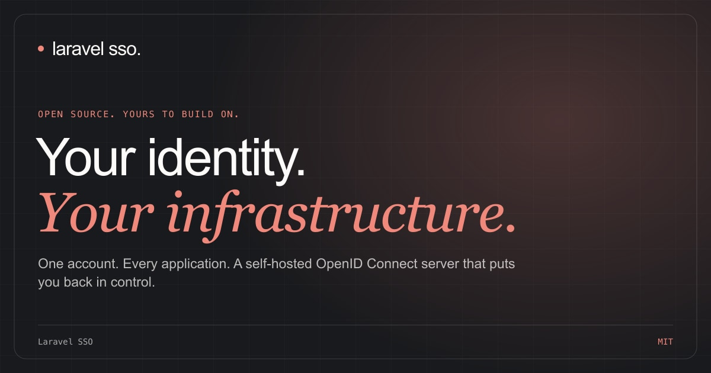

# SEO and social sharing

[Back to README](../README.md) · [Customization](customization.md) · [Deployment](deployment.md)

## Audit result

Reviewed against Astro’s official layout, site configuration, sitemap, and image guidance on **2026-09-19**. Astro provides these building blocks rather than a single SEO certification. The template implements the technical foundations below; a production domain and live-host verification are still required.

| Practice                                     | Status in this project                                                                                | Location                                    |
| -------------------------------------------- | ----------------------------------------------------------------------------------------------------- | ------------------------------------------- |
| Server-rendered HTML and meaningful headings | Applied: static page output; one homepage h1 and section headings                                     | `src/pages/index.astro`, content components |
| Per-page title and description               | Applied: defaults from project YAML; layout overrides supported                                       | `BaseHead.astro`, `types.ts`                |
| Absolute canonical URL                       | Applied: production origin plus pathname, without tab queries or fragments                            | `BaseHead.astro`                            |
| Production `site` URL                        | Configurable; shipped fallback is `https://example.com`, which must be replaced                       | `PUBLIC_SITE_URL`, `astro.config.mjs`       |
| Sitemap generation                           | Applied with `@astrojs/sitemap`; utility pages excluded                                               | `astro.config.mjs`, `src/utils/seo.ts`      |
| Sitemap discovery                            | Applied in both page head and robots.txt                                                              | `BaseHead.astro`, `robots.txt.ts`           |
| Indexing policy                              | Applied: 404 and component gallery are noindex; 404 is explicitly marked                              | `src/consts.ts`, `404.astro`                |
| Document language and viewport               | Applied: English document and responsive viewport                                                     | `BaseLayout.astro`, `BaseHead.astro`        |
| Image descriptions and optimized assets      | Applied via collection image descriptions and Astro image components; decorative images use empty alt | `ThemeImage.astro`, `Img.astro`             |
| Open Graph and X/Twitter cards               | Applied: title, description, absolute image URL, image alt, locale, and large-card type               | `BaseHead.astro`                            |
| OG image dimensions and media type           | Applied for the default image; configurable for custom images                                         | Project `seo` settings and layout props     |
| Structured data / JSON-LD                    | Not included by default; add only a schema that accurately describes your project                     | Optional `head` layout slot                 |
| Live indexing, HTTP headers, Core Web Vitals | Requires verification on the deployed site; not established by a local build                          | Your hosting and search tools               |

The audit added the head sitemap link, configurable social-image metadata, a generated card, and a repeatable output check. Existing title, description, canonical, sitemap, robots, and noindex behavior was retained.

Sources: [Astro layouts and metadata](https://docs.astro.build/en/basics/layouts/#using-typescript-with-layouts), [Astro `site`](https://docs.astro.build/en/reference/configuration-reference/#site), [sitemap usage and discovery](https://docs.astro.build/en/guides/integrations-guide/sitemap/#usage), [Astro image alt text](https://docs.astro.build/en/guides/images/#alt-text). Social-image structured properties follow the [Open Graph protocol](https://ogp.me/#structured).

## Default OG image

The supplied image is a **1200 × 630 JPEG** at [public/og-image.jpg](../public/og-image.jpg). It is served as `/og-image.jpg` and copied unchanged into the production build. This is a useful landscape sharing size, not a guarantee that every network will crop it identically.



Regenerate the card after adapting the project:

```sh
npm run og:generate
```

The generator reads `shortName`, `name`, `eyebrow`, `headline`, `headlineAccent`, `intro`, and `license` from project YAML. It reads literal dark/accent color tokens from `src/styles/base.css` and falls back to the template palette when tokens are not literal hex colors. The editable composition is in [scripts/generate-og.mjs](../scripts/generate-og.mjs). It uses local Sharp rendering, requires no API key, and replaces `public/og-image.jpg` only. It does not run automatically during builds or change the selected SEO image.

Keep the text concise, visually inspect the result, and update the image description when its content changes. System font availability can affect rendering on different machines; commit the reviewed JPEG so the deployed image is consistent. You can instead supply your own JPEG/PNG/WebP and skip generation.

## Choose the image used by social networks

Configure the site-wide default in [src/content/project/main.yaml](../src/content/project/main.yaml):

```yaml
seo:
  image: /og-image.jpg
  imageAlt: Your project name and a description of the artwork or headline.
  imageWidth: 1200
  imageHeight: 630
```

- `image` is a root-relative path to a file in `public/`, or an absolute HTTP(S) image URL. Use HTTPS in production.
- `imageAlt` describes the image rather than repeating unrelated promotional copy.
- `imageWidth` and `imageHeight` are optional positive pixel dimensions; when supplied, use the real dimensions. The built-in `/og-image.jpg` fallback assumes 1200 × 630.
- Without `seo`, the template uses `/og-image.jpg` and derives a description from the project name/headline.
- The template outputs the same image into `og:image` and `twitter:image`, with `twitter:card="summary_large_image"`.

For example, place a replacement in `public/social/project-card.png` and set `image: /social/project-card.png`. Do not use `/public/social/project-card.png` or a filesystem path. Images imported from `src/assets/` are not public URLs until Astro processes them.

For a different image on an additional page:

```astro
---
import Layout from "@/layouts/BaseLayout.astro";
---

<Layout
  title="Release notes"
  description="What changed in the latest release."
  image="/social/release-card.png"
  imageAlt="Your project’s release announcement artwork."
  imageWidth={1200}
  imageHeight={630}
>
  <h1>Release notes</h1>
</Layout>
```

A per-page image does not inherit the default image’s dimensions. Supply its own dimensions and alt text. Keep the shared head component as the single metadata source; adding duplicate OG tags in a page can cause inconsistent previews.

## Set the public URL

```dotenv
PUBLIC_SITE_URL=https://your-project.dev
```

Replace the example with your real landing-page origin in `.env` and the host’s build environment. Rebuild after changing it. This powers absolute canonical, OG image, social page, robots, and sitemap URLs. It is independent of `repository`, `docs`, `demo`, and the decorative `preview.address`.

The template targets root-domain hosting. A subpath deployment needs the extra URL adjustments described in the README; changing Astro’s `base` alone does not rewrite literal paths.

## Check before publishing

```sh
npm run check
npm run build
npm run seo:check
```

For the unconfigured starter only:

```sh
npm run seo:check -- --allow-placeholder
```

The check inspects built HTML for titles/descriptions, canonical and social consistency, document language, one h1 on indexable pages, image alt attributes, local OG files and dimensions, sitemap membership, and robots discovery. It rejects placeholder origins by default. Remote image availability needs a manual check; the command makes no network requests. Rebuild before checking so the output reflects your latest edits.

After deployment, verify that:

- Canonical, sitemap, and social-image URLs use your domain.
- The image returns an image response over HTTPS and is accessible without sign-in.
- An unknown URL returns HTTP 404 rather than a successful SPA fallback.
- Utility pages are noindex and absent from the sitemap.
- Your social platform’s preview/debugger can fetch the page. Social networks cache previews; request a refresh or use a new image filename when replacing a cached image.

No local command guarantees search rankings, indexing, rich results, performance scores, or social preview appearance. Accurate content, real project claims, useful headings, and accessible descriptions still matter after the technical checks pass.
